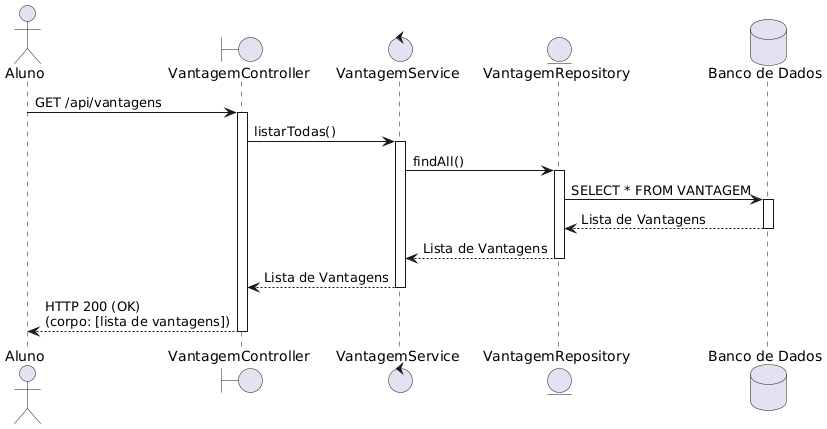
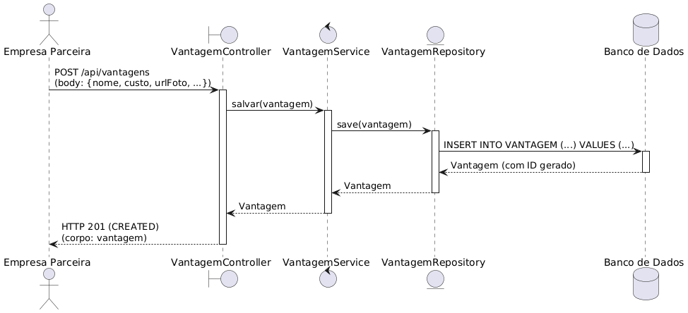
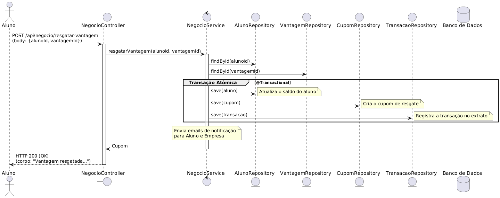

# 🏷️ StudentCoin 👨‍💻

> [!NOTE]
> Um sistema de moeda virtual para incentivar o mérito estudantil, permitindo que professores recompensem alunos e que estes troquem suas moedas por vantagens em empresas parceiras.

<table>
  <tr>
    <td width="800px">
      <div align="justify">
        O <b>StudentCoin</b> é um projeto acadêmico desenvolvido para a disciplina de Laboratório de Desenvolvimento de Software da PUC Minas. A plataforma visa criar um ecossistema de reconhecimento onde o bom desempenho e a participação dos alunos são recompensados com uma moeda digital. Essa moeda pode ser utilizada para adquirir produtos e descontos, conectando o ambiente acadêmico ao comércio local e incentivando o engajamento estudantil.
      </div>
    </td>
    <td align="center">
      <div>
        
      </div>
    </td>
  </tr> 
</table>

---

## 🚧 Status do Projeto

[](https://github.com/arthur-am/lab03_sistema_moeda_estudantil/actions)
[](https://github.com/arthur-am/lab03_sistema_moeda_estudantil)
[](#-licença)

---

## 📚 Índice
- [Links Úteis](#-links-úteis)
- [Sobre o Projeto](#-sobre-o-projeto)
- [Funcionalidades Principais](#-funcionalidades-principais)
- [Tecnologias Utilizadas](#-tecnologias-utilizadas)
- [Arquitetura](#-arquitetura)
- [Instalação e Execução](#-instalação-e-execução)
- [Deploy](#-deploy)
- [Demonstração](#-demonstração)
- [Autores](#-autores)
- [Agradecimentos](#-agradecimentos)
- [Licença](#-licença)

---

## 🔗 Links Úteis
* 🌐 **Frontend (Vercel):** (https://seu-projeto-frontend.vercel.app)
* 📖 **Backend (Render):** (https://sua-api-backend.onrender.com)

---

## 📝 Sobre o Projeto
Este projeto foi criado para resolver o desafio de engajar e recompensar estudantes de forma moderna e tangível. A ideia é que professores possam distribuir "StudentCoins" como reconhecimento por participação, boas notas ou comportamento exemplar. Os alunos acumulam essas moedas e podem trocá-las por vantagens reais, como descontos em livrarias, lanchonetes e outros serviços parceiros, criando um ciclo virtuoso de incentivo.

O sistema foi desenvolvido no contexto acadêmico da PUC Minas, visando aplicar conceitos de arquitetura MVC, desenvolvimento full-stack, e boas práticas de engenharia de software em um cenário prático.

---

## ✨ Funcionalidades Principais
- 🔐 **Autenticação de Perfis:** Login e Cadastro para Alunos e Empresas Parceiras.
- 👨‍🏫 **Gestão de Moedas:** Professores podem enviar moedas e consultar seu extrato de envios.
- 🎓 **Carteira Digital:** Alunos podem consultar saldo, extrato e resgatar vantagens.
- 🏪 **Gestão de Vantagens:** Empresas parceiras possuem um CRUD completo para gerenciar suas ofertas.
- 📨 **Notificações por E-mail:** Confirmação de transações e envio de cupons de resgate.
- 🔳 **Cupons com QR Code:** Geração de QR Code único para validação segura de resgates.

---

## 🛠 Tecnologias Utilizadas

### 💻 Front-end
* **Framework/Biblioteca:** React
* **Estilização:** Material-UI (MUI)
* **Comunicação API:** Axios

### 🖥️ Back-end
* **Linguagem/Runtime:** Java 17 (JDK)
* **Framework:** Spring Boot
* **Banco de Dados:** PostgreSQL
* **ORM:** Hibernate/JPA
* **Geração de QR Code:** Google ZXing
* **Envio de E-mail:** Brevo (para deploy) / Spring Mail (para desenvolvimento)

### ⚙️ Infraestrutura & DevOps
* **Containerização:** Docker & Docker Compose
* **Cloud (Frontend):** Vercel
* **Cloud (Backend):** Render

---

## 🏗 Arquitetura
O sistema segue uma arquitetura em camadas (N-Tier) no backend, aderindo ao padrão Model-View-Controller (MVC). O frontend é uma Single-Page Application (SPA) desacoplada que consome a API RESTful do backend. A comunicação é feita via HTTP, com troca de dados no formato JSON.

| Listagem de Vantagens (Sequência) | Cadastro de Vantagens (Sequência) | Troca de Vantagens (Sequência) |
| :---: | :---: | :---: |
|  |  |  |
| **Envio de Moedas (Comunicação)** | **Troca de Vantagens (Comunicação)** | |
|  |  | |

---

## 🔧 Instalação e Execução

### Pré-requisitos
* **Docker** e **Docker Compose** instalados.

### 🔑 Variáveis de Ambiente
Antes de executar, configure seu serviço de e-mail no arquivo `Código/backend/src/main/resources/application.properties`. Para o deploy, use as variáveis de ambiente do Render.

**Desenvolvimento Local (JavaMail/SMTP):**
```properties
spring.mail.host=smtp.gmail.com
spring.mail.port=587
spring.mail.username=seu.email.real@gmail.com
spring.mail.password=sua_senha_de_app_de_16_digitos_do_google
spring.mail.properties.mail.smtp.auth=true
spring.mail.properties.mail.smtp.starttls.enable=true
```

**Produção (Brevo API):**
```properties
brevo.api.key=${BREVO_API_KEY}
brevo.sender.name=StudentCoin
brevo.sender.email=seu-email-verificado-no-brevo@exemplo.com
```

### 🐳 Execução Local Completa com Docker Compose
1.  **Clone o Repositório:**
    ```bash
    git clone https://github.com/arthur-am/lab03_sistema_moeda_estudantil.git
    ```
2.  **Navegue para a Raiz do Projeto:**
    ```bash
    cd lab03_sistema_moeda_estudantil
    ```
3.  **Suba os Serviços:**
    ```bash
    docker-compose up --build
    ```
    > [!NOTE]
    > A aplicação estará disponível em **[http://localhost:3000](http://localhost:3000)**.

4.  **Para Parar a Aplicação:**
    Pressione `Ctrl + C` no terminal e execute:
    ```bash
    docker-compose down
    ```

---

## 🚀 Deploy

A aplicação é implantada na nuvem utilizando uma arquitetura desacoplada:

1.  **Frontend (React):** O deploy é feito na **Vercel**.
    - Conecte o repositório GitHub à Vercel.
    - Configure a variável de ambiente `VITE_API_URL` apontando para a URL do backend no Render.
    - A Vercel gerencia o build e a hospedagem global em sua CDN.

2.  **Backend (Spring Boot):** O deploy é feito no **Render**.
    - Crie um "Web Service" no Render e aponte para o repositório.
    - Configure o ambiente para Java, com build command `./mvnw package` e start command `java -jar target/student-coin-0.0.1-SNAPSHOT.jar`.
    - Adicione as variáveis de ambiente (`POSTGRES_*` e `BREVO_API_KEY`) nas configurações do serviço.

---

## 🎥 Demonstração

| Tela de Login | Painel do Aluno | Painel do Professor |
| :---: | :---: | :---: |
|  |  |  |

---

## 👥 Autores

| 👤 Nome | :octocat: GitHub | 💼 LinkedIn |
|---|---|---|
| Arthur Araújo Mendonça | [arthur-am](https://github.com/arthur-am) | [LinkedIn](https://www.linkedin.com/in/arthur-am/) |
| Eddie Christian Pereira | [EddieChristian](https://github.com/EddieChristian) | [LinkedIn](https://www.linkedin.com/in/eddie-christian-pereira-38323a1b4/) |
| Pedro Queiroz Rolim | [pedro-q-rolim](https://github.com/pedro-q-rolim) | [LinkedIn](https://www.linkedin.com/in/pedro-queiroz-rolim-a85973216/) |

---

## 🙏 Agradecimentos
* **Engenharia de Software PUC Minas** - Pelo apoio institucional e fomento à inovação.
* **Prof. Dr. João Paulo Aramuni** - Pelos valiosos ensinamentos em Arquitetura de Software e Padrões de Projeto.

---

## 📄 Licença

Este projeto é distribuído sob a **[Licença MIT](./LICENSE)**.
